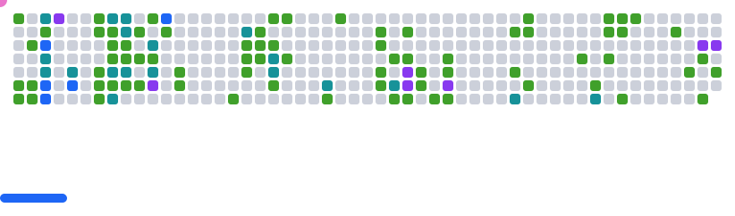
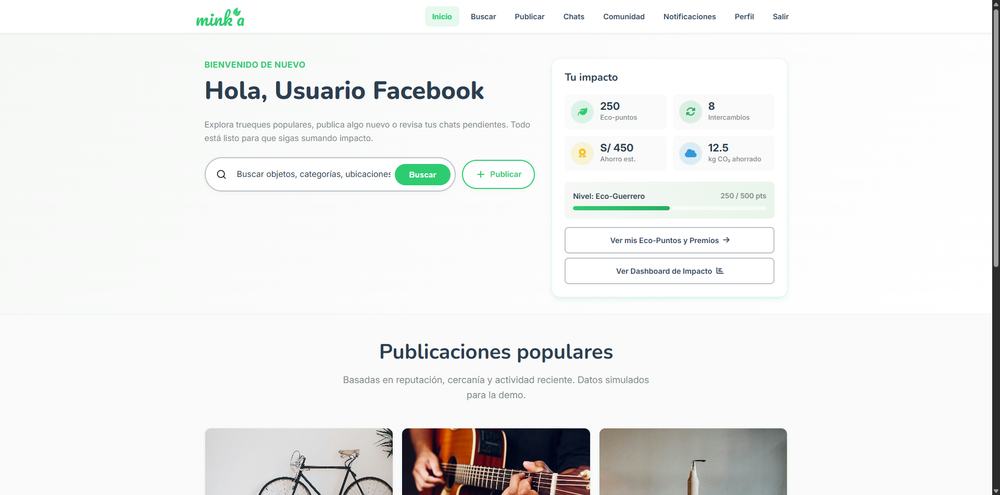
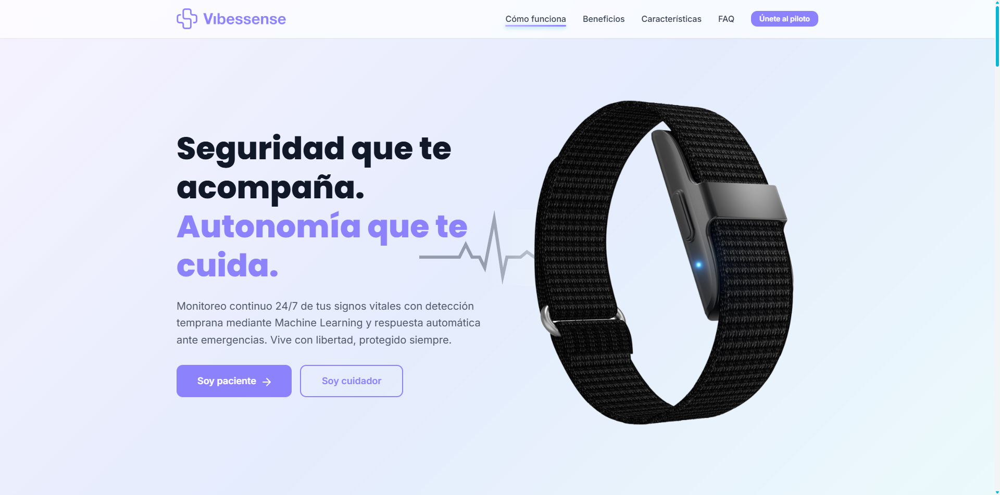
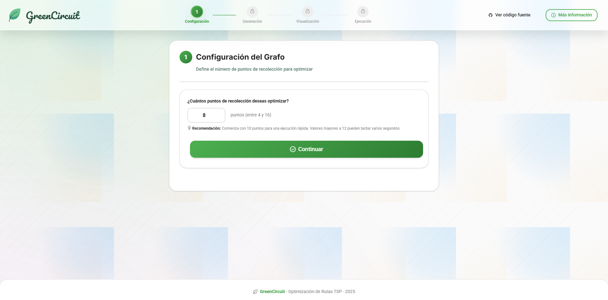
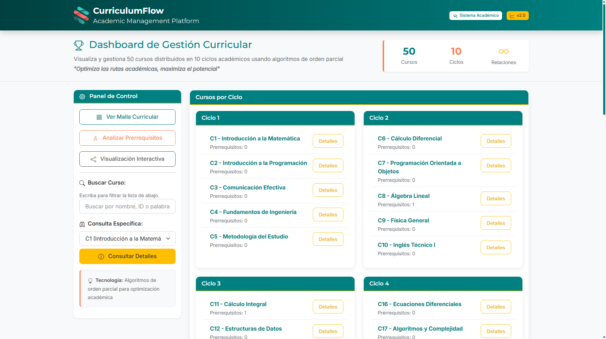

<!-- markdownlint-disable MD033 -->
<h1 align="center"> Hello! I'm Jahat | Developer & Problem Solver</h1>
<!-- markdownlint-enable MD033 -->

> C++ backend and algorithms — I focus on clear abstractions, creative problem solving, and efficient systems.

<!-- markdownlint-disable MD033 -->

  <a href="assets/docs/Resume_ES_Jahat_Trinidad.pdf">Resume (PDF)</a>
  •
  <a href="https://www.linkedin.com/in/trinitybytes">LinkedIn</a>
  •
  <a href="mailto:jahatjassiel@outlook.com">Email</a>

<!-- markdownlint-enable MD033 -->

---

## About Me 🎯

<!-- markdownlint-disable MD033 -->

<table><tr><td width="660">

Software Engineering student focused on **C++ backend** and enterprise systems. I turn ambiguous problems into clear, robust designs with strong data structures, algorithms, and layered architectures.

I enjoy building console-first apps with intuitive UX and clean separation of concerns. Curious, detail‑oriented, and collaborative.

**Currently seeking an internship** to apply my C++ skills (plus basic JS/HTML/CSS) in a real product environment.

</td></tr></table>

 

<picture>
  <source media="(prefers-color-scheme: dark)" srcset="assets/gifs/about-me-coding-dark.gif" />
  <source media="(prefers-color-scheme: light)" srcset="assets/gifs/about-me-coding-light.gif" />
  
</picture>

<!-- markdownlint-enable MD033 -->

## 📊 Quick Stats

- :round_pushpin: **Lima, PE** · **GMT-5** · **Available now**
- :computer: **Primary Language:** C++ (Intermediate/Advanced)
- :mag: **Seeking:** Software Engineering Internships
- :globe_with_meridians: **Languages:** Spanish (native), English (B1), Portuguese (A2)

<!-- markdownlint-disable MD033 -->

  <a href="https://cyprieng.github.io/github-breakout/?user=trinity-bytes">
    <picture>
      <source media="(prefers-color-scheme: dark)" srcset="assets/images/breakout/breakout-dark.svg" />
      <source media="(prefers-color-scheme: light)" srcset="assets/images/breakout/breakout-light.svg" />
      
    </picture>
  </a>
   

<!-- markdownlint-enable MD033 -->

---

## 🚀 Featured Projects

<!-- markdownlint-disable MD033 -->
<table>
<tr>
<td width="50%" valign="top">

### 🏗️ CourseraClone

  

**C++ Educational Platform**

Console-based LMS with users, courses, enrollments, payments and QR certificates.

**Tech:** C++17, STL, AVL/Hash/Heap, MVC, RAII

**Role:** Product owner & lead dev. Team of 3.

✨ 12+ custom data structures · QR certificates · Financial ledger

[📂 Repo](https://github.com/trinity-bytes/CourseraClone)

</td>
<td width="50%" valign="top">

### 🌿 Mink'a Landing

  

**Circular Economy Platform**

Landing page for a community bartering platform under a circular economy model.

**Tech:** HTML5, CSS3, JS ES6+, GitHub Actions

**Role:** Core contributor & integration lead. Team of 6.

✨ Responsive + A11y · CI/CD · 140+ commits, 6 releases

[📂 Repo](https://github.com/Reflow-Tech-UPC/Minka-Landingpage) · [🌐 Live](https://reflow-tech-upc.github.io/Minka-Landingpage/)

</td>
</tr>
</table>

### More Projects

<table>
<tr>
<td width="50%" valign="top" align="center">

<strong>💚 AllinBand Landing</strong> · IoT Wearable

Landing page for a smart wristband for vital signs monitoring and emergency detection with ML.

**Tech:** HTML5, CSS3, JavaScript

[📂 Repo](https://github.com/trinity-bytes/AllinBand-Landing) · [🌐 Live](https://trinity-bytes.github.io/AllinBand-Landing/)

</td>
<td width="50%" valign="top" align="center">

<strong>♻️ GreenCircuit</strong> · Route Optimizer

Web app to optimize urban waste collection routes using TSP with interactive visualization.

**Tech:** JavaScript, graph algorithms

[📂 Repo](https://github.com/trinity-bytes/GreenCircuit) · [🌐 Live](https://trinity-bytes.github.io/GreenCircuit/)

</td>
</tr>
<tr>
<td width="50%" valign="top" align="center">

<strong>🌐 CurriculumFLOW</strong> · Academic Pathways

Visualize prerequisites and generate valid study plans with topological sorting.

**Tech:** HTML/CSS/JS, Bootstrap 5, Cytoscape.js, Dagre.js

[📂 Repo](https://github.com/trinity-bytes/CurriculumFLOW) · [🌐 Live](https://trinity-bytes.github.io/CurriculumFLOW/)

</td>
<td width="50%" valign="top" align="center">

<strong>🎮 ForestHero2</strong> · 2D Adventure Game

Pixel-art game about protecting and reforesting a forest; resource management and combat.

**Tech:** C++14, C++/CLI, Windows Forms

[📂 Repo](https://github.com/trinity-bytes/ForestHero2)

</td>
</tr>
</table>
<!-- markdownlint-enable MD033 -->

---

## 🛠️ My Technical Skills

Core strengths

- Strong C++ abstractions: data structures and algorithms from scratch (AVL, Hash, Heap, BST, linked lists).
- Product-thinking + systems design: layered architecture, clear separation of concerns, and console UI that feels intuitive.
- Practical graph work: topological sort (Kahn) and Hasse reduction with CSV/JSON exports and basic A11y.

Core skills for C++ backend

- Strong: C++17, STL, DS/algorithms, RAII, file I/O, modular design.
- Solid: Patterns (MVC/Strategy/Factory), exceptions, MSVC/Visual Studio, Git.
- Basic: SQLite, JS/HTML/CSS, GitHub Actions, Linux fundamentals.

Here are the technologies I work with and am familiar with:

| Category                     | Skills                                                                                                                                                                                                                                                                                                                                                                                                                                                                                                                                                                                                                                                               |
| :--------------------------- | :------------------------------------------------------------------------------------------------------------------------------------------------------------------------------------------------------------------------------------------------------------------------------------------------------------------------------------------------------------------------------------------------------------------------------------------------------------------------------------------------------------------------------------------------------------------------------------------------------------------------------------------------------------------- |
| **Languages**                |       |
| **Frontend**                 |                                                                                                                                              |
| **Backend & Runtime**        |                                                                                                                                                                                                                                                                                                                                                                                                                                                                                                                                                           |
| **Databases**                |                                                                                                                                                                                                                        |
| **Libraries**                |                                                                                                                                                                                                                                                                                                                    |
| **DevOps & Version Control** |                                                                                                                                                                                                                                 |
| **IDEs & Editors**           |                                                                                                                                                                                 |
| **Design & AI Tools**        |                                                                                                                                                                                                             |

---

<!-- markdownlint-disable MD033 -->

Thanks for visiting my profile! Ready to collaborate on the next big project? Let's connect! 🚀

<!-- markdownlint-enable MD033 -->
