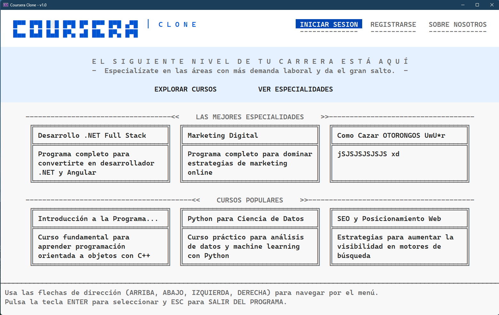
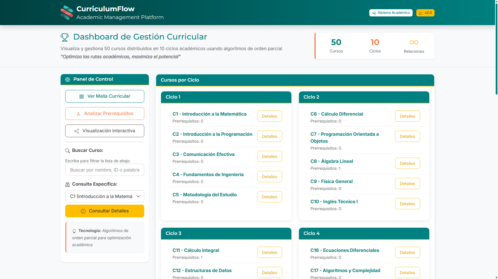
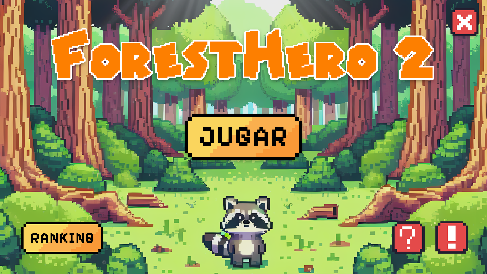
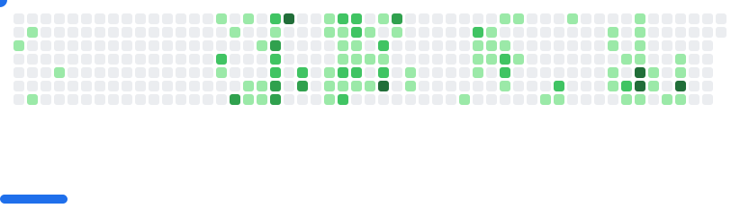
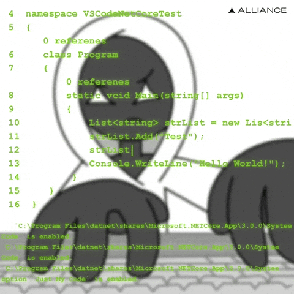

<!-- markdownlint-disable MD033 -->
<h1 align="center"> Hello! I'm Jahat | Developer & Problem Solver</h1>
<!-- markdownlint-enable MD033 -->

> C++ backend and algorithms — I focus on clear abstractions, creative problem solving, and efficient systems.

<!-- markdownlint-disable MD033 -->

  <a href=".github/assets/Resume_ES_Jahat_Trinidad.pdf">Resume (PDF)</a>
  •
  <a href="https://www.linkedin.com/in/trinitybytes">LinkedIn</a>
  •
  <a href="mailto:jahatjassiel@outlook.com">Email</a>

<!-- markdownlint-enable MD033 -->

---

## 🚀 Featured Projects

### 🏗️ CourseraClone — C++ Educational Platform (Primary)

<!-- markdownlint-disable MD033 -->

  

- **What it is:** Console-based LMS simulating an online course platform (users, courses, enrollments, payments, QR certificates).
- **Tech:** C++17, STL, custom DS (AVL, hash, heap), layered MVC, RAII.
- **Role:** Product owner & lead dev (console UX with arrows/enter, certificates, receipts, architecture). Team of 3.
- **Highlights:**
  - 12+ data structures from scratch
  - Search/sort, indexing, and robust persistence
  - QR certificates with code validation
  - Receipts and a basic financial ledger
- **Repo:** [CourseraClone](https://github.com/trinity-bytes/CourseraClone)

  
<strong>🌐 CurriculumFLOW — Academic Pathway Optimizer</strong> · Web app for visualizing and optimizing curricula (click to expand)

  

    
  

- **What it is:** Visualize prerequisites and generate valid study plans with topological sorting.
- **Tech:** HTML/CSS/JS, Bootstrap 5, Cytoscape.js, Dagre.js.
- **Highlights:** Kahn topo sort + Hasse reduction; CSV/JSON import-export; offline ready.
- **Links:** [Repo](https://github.com/trinity-bytes/CurriculumFLOW) · [Live](https://trinity-bytes.github.io/CurriculumFLOW/)

  
<strong>🎮 ForestHero2 — 2D Environmental Adventure</strong> · C++/CLI Windows Forms game (click to expand)

  

    
  

- **What it is:** Pixel-art game about protecting and reforesting a forest; resource management and combat.
- **Tech:** C++14, C++/CLI, Windows Forms, System::Drawing; basic audio and persistence.
- **Highlights:** Solid game loop (states/input/timing), reforestation mechanics, UI screens, sound effects/music.
- **Link:** [Repo](https://github.com/trinity-bytes/ForestHero2)

<!-- markdownlint-enable MD033 -->

## 📊 Quick Stats

- :round_pushpin: **Lima, PE** · **GMT-5** · **Available now**
- :computer: **Primary Language:** C++ (Intermediate/Advanced)
- :mag: **Seeking:** Software Engineering Internships
- :globe_with_meridians: **Languages:** Spanish (native), English (B1), Portuguese (A2)

<!-- markdownlint-disable MD033 -->
<picture>
  <source
    media="(prefers-color-scheme: dark)"
    srcset="images/breakout-dark.svg"
  />
  <source
    media="(prefers-color-scheme: light)"
    srcset="images/breakout-light.svg"
  />
  
</picture>

  <picture>
  <source media="(prefers-color-scheme: dark)" srcset="https://github-readme-stats.vercel.app/api/top-langs/?username=trinity-bytes&theme=catppuccin_mocha&hide_border=false&include_all_commits=true&count_private=true&layout=compact&cache_seconds=7200" />
  <source media="(prefers-color-scheme: light)" srcset="https://github-readme-stats.vercel.app/api/top-langs/?username=trinity-bytes&theme=catppuccin_latte&hide_border=false&include_all_commits=true&count_private=true&layout=compact&cache_seconds=7200" />
  
  </picture>

<!-- markdownlint-enable MD033 -->

---

## 🛠️ My Technical Skills

Core strengths

- Strong C++ abstractions: data structures and algorithms from scratch (AVL, Hash, Heap, BST, linked lists).
- Product-thinking + systems design: layered architecture, clear separation of concerns, and console UI that feels intuitive.
- Practical graph work: topological sort (Kahn) and Hasse reduction with CSV/JSON exports and basic A11y.

Core skills for C++ backend

- Strong: C++17, STL, DS/algorithms, RAII, file I/O, modular design.
- Solid: Patterns (MVC/Strategy/Factory), exceptions, MSVC/Visual Studio, Git.
- Basic: SQLite, JS/HTML/CSS, GitHub Actions, Linux fundamentals.

Here are the technologies I work with and am familiar with:

| Category            | Skills                                                                                                                                                                                                                                                                                                                                                                                                                                                                                                                                                                                                                                                                                                                                                 |
| :------------------ | :----------------------------------------------------------------------------------------------------------------------------------------------------------------------------------------------------------------------------------------------------------------------------------------------------------------------------------------------------------------------------------------------------------------------------------------------------------------------------------------------------------------------------------------------------------------------------------------------------------------------------------------------------------------------------------------------------------------------------------------------------- |
| **Languages**       |        |
| **Tools**           |                                                                   |
| **Databases**       |                                                                                                                                                                                                                                                                                                                                                                                                                                                                                                                                               |
| **Frameworks/Libs** |                                                                                                                                                                                                                                                                                                                                                                                                                                       |

---

## About Me 🎯

<!-- markdownlint-disable MD033 -->
<picture>
  <source media="(prefers-color-scheme: dark)" srcset=".github/assets/gifs/about-me-coding-dark.gif" />
  <source media="(prefers-color-scheme: light)" srcset=".github/assets/gifs/about-me-coding-light.gif" />
  
</picture>
<!-- markdownlint-enable MD033 -->

Software Engineering student focused on C++ backend and enterprise systems. I turn ambiguous problems into clear, robust designs with strong data structures, algorithms, and layered architectures. I enjoy building console-first apps with intuitive UX and clean separation of concerns. Curious, detail‑oriented, and collaborative. Currently seeking an internship to apply my C++ skills (plus basic JS/HTML/CSS) in a real product environment.

---

<!-- markdownlint-disable MD033 -->

Thanks for visiting my profile! Ready to collaborate on the next big project? Let's connect! 🚀

<!-- markdownlint-enable MD033 -->
