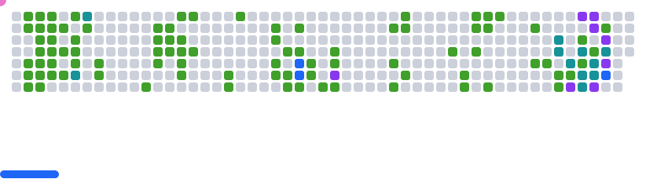
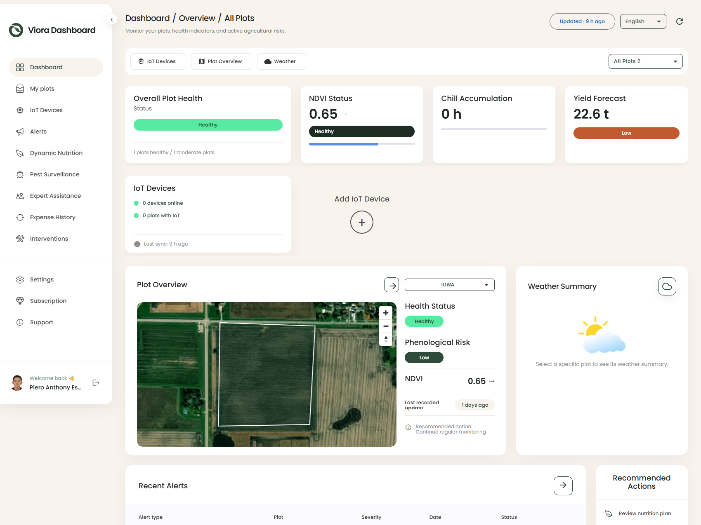
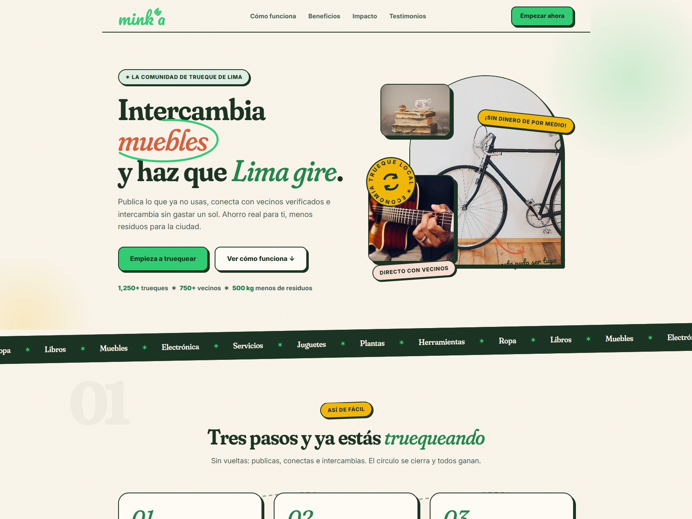

# Hi! I'm Jahat, a developer & problem solver

> C++, databases & algorithms — I focus on clear abstractions, creative problem solving, and efficient systems.

<!-- markdownlint-disable MD033 -->

  <!-- TODO: uncomment when the portfolio is live
  
  -->
  
  
  

<!-- markdownlint-enable MD033 -->

---

## About Me

<!-- markdownlint-disable MD033 -->
<table>
<tr>
<td width="65%" valign="middle">

Software Engineering student focused on **C++**, **databases**, and **UI/UX design**. I turn ambiguous problems into clear, robust designs — and I've led a 6-person team using GitFlow and sprint-based management.

**Currently seeking an internship** to apply my C++, SQL, and frontend skills in a real product environment.

- :round_pushpin: **Lima, PE** · **GMT-5** · **Available now**
- :globe_with_meridians: **Languages:** Spanish (native), English (B1), Portuguese (A2)

</td>
<td width="35%" align="center" valign="middle">

<picture>
  <source media="(prefers-color-scheme: dark)" srcset="https://raw.githubusercontent.com/trinity-bytes/trinity-bytes/main/assets/gifs/about-me-coding-dark.gif" />
  <source media="(prefers-color-scheme: light)" srcset="https://raw.githubusercontent.com/trinity-bytes/trinity-bytes/main/assets/gifs/about-me-coding-light.gif" />
  
</picture>

</td>
</tr>
</table>
<!-- markdownlint-enable MD033 -->

## Stats

<!-- markdownlint-disable MD033 -->

  <picture>
    <source media="(prefers-color-scheme: dark)" srcset="https://github-readme-stats-lake-chi-49.vercel.app/api?username=trinity-bytes&theme=catppuccin_mocha&hide_border=true&include_all_commits=true&count_private=true" />
    <source media="(prefers-color-scheme: light)" srcset="https://github-readme-stats-lake-chi-49.vercel.app/api?username=trinity-bytes&theme=catppuccin_latte&hide_border=true&include_all_commits=true&count_private=true" />
    
  </picture>
  <picture>
    <source media="(prefers-color-scheme: dark)" srcset="https://github-readme-stats-lake-chi-49.vercel.app/api/top-langs/?username=trinity-bytes&theme=catppuccin_mocha&hide_border=true&layout=compact" />
    <source media="(prefers-color-scheme: light)" srcset="https://github-readme-stats-lake-chi-49.vercel.app/api/top-langs/?username=trinity-bytes&theme=catppuccin_latte&hide_border=true&layout=compact" />
    
  </picture>

  <a href="https://cyprieng.github.io/github-breakout/?user=trinity-bytes">
    <picture>
      <source media="(prefers-color-scheme: dark)" srcset="assets/images/breakout/breakout-dark.svg" />
      <source media="(prefers-color-scheme: light)" srcset="assets/images/breakout/breakout-light.svg" />
      
    </picture>
  </a>

<!-- markdownlint-enable MD033 -->

---

## Featured Projects

<!-- markdownlint-disable MD033 -->
<table>
<tr>
<td width="50%" valign="top">

### Viora

  

**Agricultural Monitoring Platform**

Full-stack web app for real-time crop monitoring: NDVI analytics, IoT sensor data, weather integration, yield forecasts, and interactive Mapbox maps.

**Tech:** Angular 21, TypeScript, SCSS, Spring Boot 4, Java 26, PostgreSQL, Spring Security, JWT, Docker, Firebase, Mapbox GL, Chart.js

**Role:** Full-stack contributor (frontend & backend). Team project.

[📂 Repo](https://github.com/upc-pre-1asi0729-11848-arcadiadevs/viora-webapp) - [🌐 Live](https://viora-webapp.web.app/)

</td>
<td width="50%" valign="top">

### Mink'a

  

**Circular Economy Platform**

A community bartering platform under a circular economy model.

**Tech:** HTML5, CSS3, JS ES6+, GitHub Actions

**Role:** Core contributor & integration lead. Team of 6.

[📂 Repo](https://github.com/trinity-bytes/minka) - [🌐 Live](https://trinity-bytes.github.io/minka/)

</td>
</tr>
</table>
<!-- markdownlint-enable MD033 -->

<!-- TODO: when the portfolio is live, point this line to it -->
More projects on my [GitHub repositories](https://github.com/trinity-bytes?tab=repositories).

---

<!-- markdownlint-disable MD033 -->

Thanks for visiting my profile! Ready to collaborate on the next big project? Let's connect! 🚀

<!-- markdownlint-enable MD033 -->
